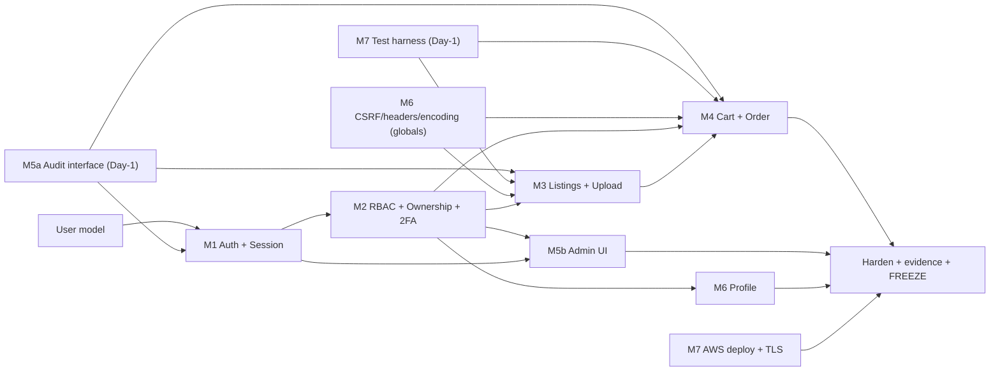

# Chateau Collective — D2 Sequencing & Load View

Companion to `docs/d2/dev_task_tickets.md`. Use this to (a) see who blocks whom, (b) decide who starts first, and (c) confirm the 7-way split is balanced before assigning names.

**Window:** Mon 29 Jun → freeze EOD **Tue 7 Jul** (9 calendar days). Report finalize Wed 8 Jul, submit Thu 9 Jul 09:00.

---

## 1. Critical path (the chain that decides the deadline)

```
User model → M1 Auth/Session → M2 Ownership helper → M3 Listing (read) → M4 Cart/Order → tests + evidence → FREEZE
```

Everything else can run alongside this chain, but this chain **cannot be parallelized away** — each link needs the previous one. If any link slips, the freeze slips. Protect it:

- **M1 + M2 must merge by EOD Wed 1 Jul.** The whole team builds on them.
- **M3 must deliver listing *read* (model + index/detail) by Fri 3 Jul** so M4 can wire the buy-flow over the weekend. M3's seller-create + upload-hardening can finish *after* that, in parallel with M4.
- M1/M2 PRs get **priority review turnaround** — no spine PR waits in the queue.

---

## 2. Dependency graph



Two tickets are deliberately **split** so they don't become hidden blockers:
- **M5 → M5a (audit interface, Day-1) + M5b (admin UI, later).** The `audit_service.record(...)` interface must publish on Day 1 because M1/M3/M4 all call it. The admin dashboard that consumes it can come later (it needs M1/M2 first).
- **M7 → test harness (Day-1) + AWS deploy (Phase 1+).** Fixtures/conftest must land early so everyone can write tests; deploy needs a runnable app.

---

## 3. Dependency table

| Ticket | Depends on (can't finish without) | Blocks (waiting on it) | Must start / land by |
|---|---|---|---|
| **M1** Auth+Session | User model, M5a audit interface | M2, M5b, every protected route | Start Day 1 · land Wed 1 Jul |
| **M2** RBAC+Ownership+2FA | M1 (current_user) | M3, M4, M5b, M6 | Start Day 1 (scaffold) · land Wed 1 Jul |
| **M3** Listings+Upload | M1, M2, M5a, M6 globals, M7 harness | M4 (needs listings to buy) | Read path by Fri 3 · full by Sun 5 |
| **M4** Cart+Order | M3 (read path), M1/M2, M5a | M9/M11 stretch | Start Fri 3 · land Sun 5 |
| **M5a** Audit interface | — (minimal deps) | M1, M3, M4 | **Publish Day 1** |
| **M5b** Admin UI | M1, M2 | — | Start Thu 2 · land Sun 5 |
| **M6** Crosscuts+Profile | M1/M2 (profile only); globals have no deps | M3, M4 (CSRF/headers/encoding) | Globals Day 1–2 · profile by Sun 5 |
| **M7** DevSecOps/Deploy | nothing to start; deploy needs runnable app | everyone's CI; freeze evidence | Harness Day 1 · deploy Mon 6–Tue 7 |

**Day-1 must-publish list (these unblock parallel work):** M5a audit interface · M7 test harness/fixtures · M6 CSRF + headers + encoding globals · User model finalized.

---

## 4. Load estimate per ticket (hardened = code + control wired + tests + evidence)

| Ticket | Person-days | What drives the size |
|---|---|---|
| **M1** Auth+Session | **4.5** | full session lifecycle (regeneration/timeout/cookie flags) + rate-limit + failed-login logging + tests + login sequence diagram |
| **M2** RBAC+Ownership+2FA | **4.0** | applying decorators across *every* route as they land (coordination-heavy) + admin 2FA + negative tests |
| **M3** Listings+Upload | **4.0** | MIME/signature upload validation + seller-create + buyer-browse + templates |
| **M4** Cart+Order | **4.5** | order-workflow state machine + cart ownership + price-tamper defence + tests |
| **M5** Admin+Audit | **3.5** | audit interface (small but early) + admin log viewer + 2FA gating |
| **M6** Crosscuts+Profile | **4.0** | global CSRF/headers/encoding/error-handling + profile + OWASP mapping table |
| **M7** DevSecOps/Deploy | **5.0** | AWS deploy + Nginx/Gunicorn/systemd + HTTPS/TLS + 4 green pipelines + evidence pack |
| **Total** | **~29.5 pd** | across 7 members |

---

## 5. Capacity vs load — is the split balanced?

- **Estimated capacity:** part-time student effort ≈ 0.6 effective person-day/day × ~9 days ≈ **~5.4 pd per member** → ~38 pd team capacity.
- **Load:** ~29.5 pd. **Team-wide buffer ≈ 8 pd (~1.1 pd/person).** Busy, but not over-committed — *provided the critical path holds*.
- **Balance:** all tickets sit in a tight **3.5–5.0 pd** band. No one is overloaded or idle. Heaviest: **M7 (5.0)** and **M1/M4 (4.5)**. Lightest: **M5 (3.5)**.

**Caveat:** total capacity is comfortable, but the **critical path (M1→M2→M3→M4) is the real constraint**, not headcount. You cannot throw the spare 8 pd at the spine — it's sequential. Extra hands help *breadth and tests*, not the spine. That's why M1/M2 should be your two strongest/fastest people.

---

## 6. Who to assign where (skills signal for name mapping)

| Ticket | Put here the person who is… | Headroom for stretch? |
|---|---|---|
| **M1, M2** | your **two strongest** — they're on the critical path and everyone waits on them | M2 frees up first post-spine → strong M8/M10 candidate |
| **M7** | best with **CI / Linux / AWS / TLS** — most independent, can start Day 1 | low (heaviest, runs full window) |
| **M3, M4** | solid full-stack builders comfortable with forms/templates/state | low (on critical path) |
| **M5** | reliable; **lightest load** → finishes earliest | **most headroom → first stretch-ticket taker** |
| **M6** | detail-oriented (security cross-cuts are fiddly, plus owns the OWASP table) | medium |

**Stretch-capacity order (who can pick up M8–M12 first):** M5 → M2 (post-spine) → M6.

---

## 7. Day-by-day schedule (critical path overlaid)

| Day | Critical path | In parallel |
|---|---|---|
| Mon 29 | M1 auth start · M2 decorator scaffold | M5a interface · M7 harness · M6 globals · models |
| Tue 30 | M1 session lifecycle · M2 ownership helper | M7 CI green · M6 headers/CSRF |
| **Wed 1** | **M1 + M2 MERGE (spine gate)** | M5a stable · M6 globals done |
| Thu 2 | M3 listing read starts | M5b admin UI start · M6 profile |
| **Fri 3** | **M3 listing read delivered** | M4 cart scaffold begins |
| Sat 4 | M4 buy-flow integrates with M3 | M3 seller-create + upload hardening |
| **Sun 5** | **All core slices working end-to-end (gate)** | M5b/M6 land · stretch tickets may start |
| Mon 6 | Harden + security/negative tests | M7 AWS deploy + TLS |
| **Tue 7** | **FREEZE EOD** · evidence pack complete | M7 deploy verified, Actions history captured |

---

## 8. Top sequencing risks

1. **Spine slips past Wed 1 Jul** → everything cascades. Mitigation: M1/M2 are strongest people + priority review.
2. **M3→M4 handoff is the tightest link** (shared Thu–Sun window). Mitigation: M3 delivers *read path* by Fri 3 regardless of upload polish.
3. **M7 AWS deploy + TLS eats time** (classic). Mitigation: M7 stands up deploy infra early in parallel, doesn't wait until Mon 6 to first attempt it.
4. **Audit interface churn** if M5a's signature changes mid-week → breaks M1/M3/M4 callers. Mitigation: freeze the `audit_service.record(...)` signature Day 1, treat as a contract.
